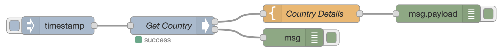
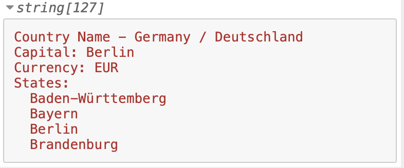

# node-red-contrib-graphql

[](https://nodered.org)


A NodeRed node to execute GraphQL Queries.

## Install

Run command on Node-RED installation directory.

```
npm install node-red-contrib-graphql
```

## Change Log

| Vers  | Changes                                                                                                                                                                                                     |
| ----- | ----------------------------------------------------------------------------------------------------------------------------------------------------------------------------------------------------------- |
| 1.1.0 | [Error Handling & Config Templates](https://github.com/rgstephens/node-red-contrib-graphql/pull/11/), [showDebug & customHeaders](https://github.com/rgstephens/node-red-contrib-graphql/pull/22/conflicts) |
| 1.0.1 | [Bump axios](https://github.com/rgstephens/node-red-contrib-graphql/pull/20)                                                                                                                                |
| 1.0.0 | pass Authorization via msg.authorization, [PR #21](https://github.com/rgstephens/node-red-contrib-graphql/pull/21)                                                                                          |

## GraphQL Node

Provides a GraphQL node to support queries and a supporting Configuration node to point to a GraphQL server.

### Node Fields

| Name             | Use                        |
| ---------------- | -------------------------- |
| GraphQL Endpoint | URL to the endpoint        |
| Query            | Query or Mutation template |


### Template flavors and uses

There are two template flavors:

1. Plain
2. Mustache

At the bottom of the template text area, you must select between plain or mustache template.

If you select mustache, your template will be processed by Mustache with the message's payload as an argument. I.e.

```
submitted_template = mustache("template in text area", msg.payload)
```

If you select plain, the template is left as it is.

### Template variables

You can add GraphQL query variables to the submitted query by defining them in the `msg.variables` property.
Your variables will be passed over to the GraphQL query.

For exemple, if you define

```
type Response {
  ok: boolean
}

input doSomethingInput {
  myVar: String
}

type Mutation {
  doSomething(input: doSomethingInput!): Response
}

```

you can pass the `messageInput` parameter as such in Node-Red msg:

```
msg.variables = {
  "input": {
    "myVar": "myValue"
  }
}
```

it will be added to the GraphQL query:


```
query: `mutation doSomething($input: messageInput!) {
  doSomething(input: $input) {
    ok
  }
}`,
variables: {
  input: {
    myVar: "myValue"
  }
}
```

When using a scalar type like [JSON](https://github.com/taion/graphql-type-json), the entire payload can conveniently be
passed as an input parameter:

```
scalar JSON

type Response {
  ok: boolean
}

input payloadInput {
  payload: JSON
}

type Mutation {
  doSomething(input: payloadInput!): Response
}

```

In node-red flow, prepare `payloadInput` variables:
```
msg.variables = {
  "input": {
    "payload": msg.payload
  }
}
```

which will results in
```
query: `mutation doSomething($input: payloadInput!) {
  doSomething(input: $input) {
    ok
  }
}`,
variables: {
  input: {
    myVar: { whatever: "was in you msg.payload", val: 5, bool: true }
  }
}
```

The execution will return the value in:
```
msg.payload.doSomething
```
object.


### Outputs

`payload` is loaded with the output of the Query or Mutation. If the Query is named `doSomething`, the results of the query will be in `payload.doSomething`.

```
//msg.payload is:
{
  doSomething: {
    ok: true
  }
}
```

## ToDo's

* Add support for authentication and a token
* Test Mutations

## Installing and using the Example Flow

This example flow uses the `node-red-contrib-graphql` node to query the Deutsche Bahn GraphQL service and get a station address and details on the next departure.

The example flow is in the file `deutscheBahnFlow.json`. Import this file from the clipboad under the NodeRed menu `Import > Clipboard`.  You'll drag the example flow onto NodeRed.



This is the result sent to the debug window.



## Example Queries

Here's a [list](https://github.com/APIs-guru/graphql-apis) of public GraphQL API's

### Deutsche Bahn

Endpoint: `https://developer.deutschebahn.com/free1bahnql/graphql`

```
{
   search(searchTerm: "Herrenberg") {
     stations {
       name
       stationNumber
       primaryEvaId
     }
     operationLocations {
       name
       id
       regionId
       abbrev
       locationCode
     }
   }
}
```

```
{
  stationWithEvaId(evaId: 8004168) {
    name
  }
}
```

```
{
   stationWithStationNumber(stationNumber: 6071) {
    name
    mailingAddress {
      street
      city
      zipcode
    }
    federalState
    location {
      latitude
      longitude
    }
    szentrale {
      name
      email
      number
      phoneNumber
    }
    hasParking
    timetable {
      nextDepatures {
        type
        trainNumber
        platform
        time
        stops
      }
    }
    hasWiFi
    hasParking
  }
}
```

```
{
   stationWithStationNumber(stationNumber: 2726) {
    name
    mailingAddress {
      street
      city
      zipcode
    }
    federalState
    regionalArea {
      name
    }
    szentrale {
      name
      email
      number
      phoneNumber
    }
    hasWiFi
    hasParking
   }
}
```

### http://gstephens.org:4000

**getGolferById**

```
{
  getGolferById(id: "3315181") {
    ghinNum
    firstName
    lastName
    state
    handicapIndex
    trend
  }
}
```

Template to grab GHIN Number:

```
This is the GHIN Number: {{payload.getGolferById.ghinNum}} 
```

#### getGolfers

```
{
    getGolfers(state: "WA", lastName: "Stephens", firstName: "M") {
        golferCount
        golfers {
          ghinNum
          firstName
          lastName
          trend
          handicapIndex
          email
          address1
          address2
          city
          state
          clubName
        }
    }
}
```