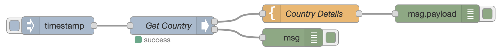
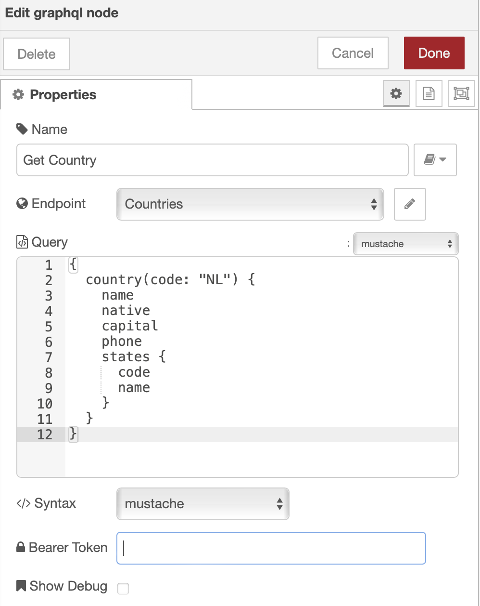
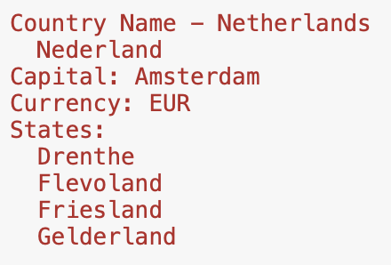
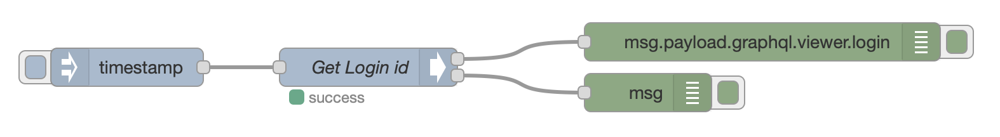
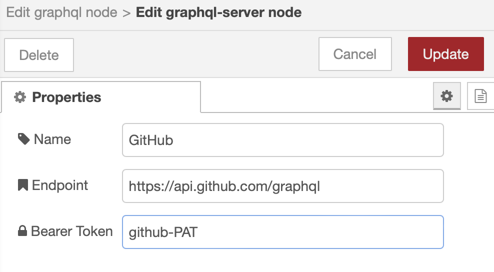
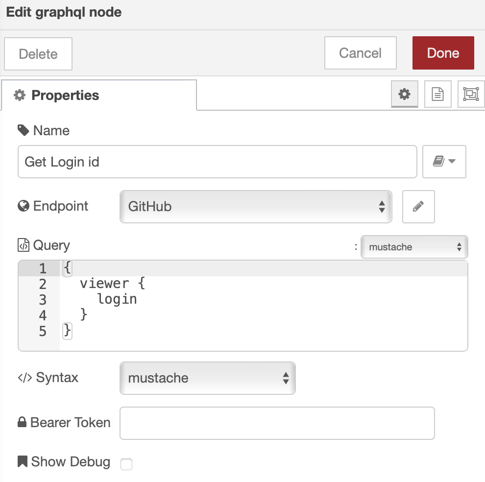
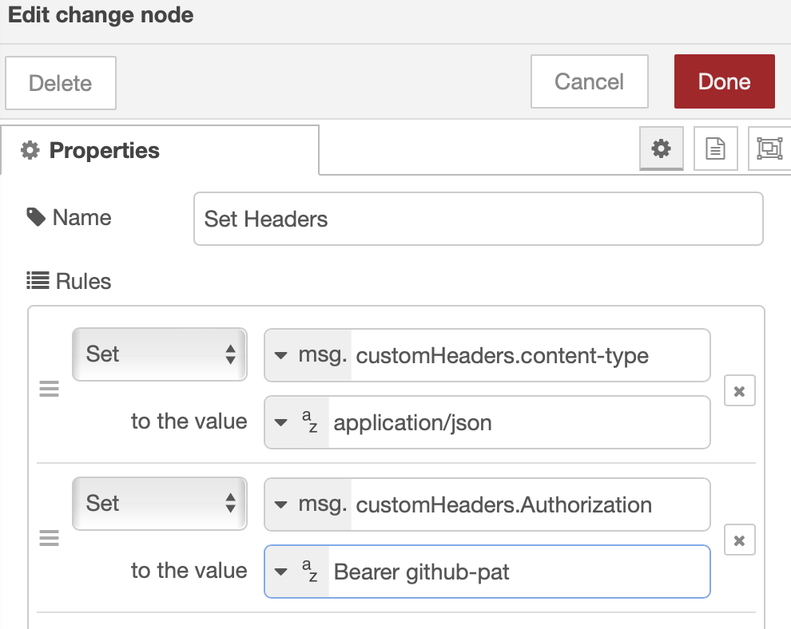

# node-red-contrib-graphql

[](https://nodered.org)


[](https://www.codacy.com/gh/rgstephens/node-red-contrib-graphql?utm_source=github.com&amp;utm_medium=referral&amp;utm_content=rgstephens/node-red-contrib-graphql&amp;utm_campaign=Badge_Grade)

A NodeRed node to execute GraphQL Queries.

## Change Log

| Vers  | Changes       |
| ----- | -------------------------------------------------------- |
| 2.2.0 | Really fix payload issue |
| 2.1.2 | Fix payload init issue |
| 2.1.0 | Bearer Token Authentication |
| 2.0.1 | Update dependencies (`axios` & `mustache`), fix node-red scorecard issues |
| 2.0.0 | GraphQL response is now on `payload.graphql` instead of replacing `payload`. This is a breaking change. Addresses #32 |
| 1.4.1 | Bump `follow-redirects` to 1.14.8 |
| 1.4.0 | improve debug, bump `follow-redirects` |
| 1.3.0 | bump axios to address CVE-2021-3749 |
| 1.2.0 | [Fix node not showing in palette](https://github.com/rgstephens/node-red-contrib-graphql/pull/24), bump axios |
| 1.1.0 | [Error Handling & Config Templates](https://github.com/rgstephens/node-red-contrib-graphql/pull/11/), [showDebug & customHeaders](https://github.com/rgstephens/node-red-contrib-graphql/pull/22/conflicts), [Bump axios](https://github.com/rgstephens/node-red-contrib-graphql/pull/20) |
| 1.0.0 | pass Authorization via msg.authorization, [PR #21](https://github.com/rgstephens/node-red-contrib-graphql/pull/21)|
| 0.0.6 | Initial Release |

## GraphQL Nodes

Provides a `GraphQL` node to support queries and a configuration node called `graphql-server`.

### `graphql-server` Configuration Node Fields

| Name     | Use                 |
| -------- | ------------------- |
| Name     | Node Name           |
| Endpoint | URL to the endpoint |
| Token    | Bearer Token        |

### `graphql` Function Node Fields

| Name       | Use                        |
| ---------- | -------------------------- |
| Name       | Node Name                  |
| Endpoint   | Configuration Node Name    |
| Query      | Query or Mutation template |
| Syntax     | Mustache / plain           |
| Token      | Bearer Token               |
| Show Debug | Enable debug               |

## Countries API Example

This example flow uses the `node-red-contrib-graphql` node to query the [Countries API](https://github.com/trevorblades/countries) built by GitHub user [Trevor Blades](https://github.com/trevorblades).

The example flow is in the file `examples/countries.json`. Import this file from the clipboard under the NodeRed menu `Import > Clipboard`. You'll drag the example flow onto NodeRed.



### Edit graphql node

The GraphQL endpoint for is `https://countries.trevorblades.com/`. You can try it out [here](https://countries.trevorblades.com/). Here's the `graphql-node`:



###  GraphQL Output

This is the result sent to the debug window.



## Authentication Example

A bearer token can be provided for authentication. This is an example using the GitHub GraphQL API which is documented [here](https://docs.github.com/en/graphql/guides/forming-calls-with-graphql#communicating-with-graphql).



### Config Node Token

If you have an token with a long life, you can provide the token in the `graphql-server` configuration node. For GitHub, user your GitHub PAT.



You can also provide the token in the `graphql` node. This is useful if a prior node performs the authentication and returns the token to be used for a limited session.



## Custom Headers

You can provide custom headers to the GraphQL node by attaching a `customHeaders` key to the `msg` and passing that to the GraphQL node. Here's an example that sets the `content-type` and a bearer token.



## Templates and Variable Use

There are two template flavors:

1. Plain
2. Mustache

At the bottom of the template text area, you must select between plain or mustache template.

If you select mustache, your template will be processed by Mustache with the message's payload as an argument. I.e.

```
submitted_template = mustache("template in text area", msg.payload)
```

If you select plain, the template is left as it is.

### Template variables

You can add GraphQL query variables to the submitted query by defining them in the `msg.variables` property.
Your variables will be passed over to the GraphQL query.

For example, if you define

```
type Response {
  ok: boolean
}

input doSomethingInput {
  myVar: String
}

type Mutation {
  doSomething(input: doSomethingInput!): Response
}

```

you can pass the `messageInput` parameter as such in Node-Red msg:

```
msg.variables = {
  "input": {
    "myVar": "myValue"
  }
}
```

it will be added to the GraphQL query:

```
query: `mutation doSomething($input: messageInput!) {
  doSomething(input: $input) {
    ok
  }
}`,
variables: {
  input: {
    myVar: "myValue"
  }
}
```

When using a scalar type like [JSON](https://github.com/taion/graphql-type-json), the entire payload can conveniently be
passed as an input parameter:

```
scalar JSON

type Response {
  ok: boolean
}

input payloadInput {
  payload: JSON
}

type Mutation {
  doSomething(input: payloadInput!): Response
}

```

In node-red flow, prepare `payloadInput` variables:

```
msg.variables = {
  "input": {
    "payload": msg.payload
  }
}
```

which will results in

```
query: `mutation doSomething($input: payloadInput!) {
  doSomething(input: $input) {
    ok
  }
}`,
variables: {
  input: {
    myVar: { whatever: "was in you msg.payload", val: 5, bool: true }
  }
}
```

The execution will return the value in:

```
msg.payload.doSomething
```

object.

### Outputs

`payload` is loaded with the output of the Query or Mutation. If the Query is named `doSomething`, the results of the query will be in `payload.doSomething`.

```
//msg.payload is:
{
  doSomething: {
    ok: true
  }
}
```
